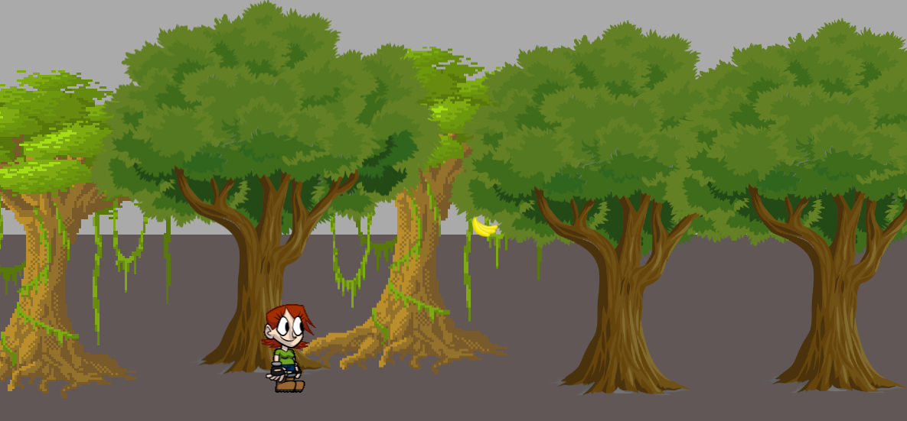
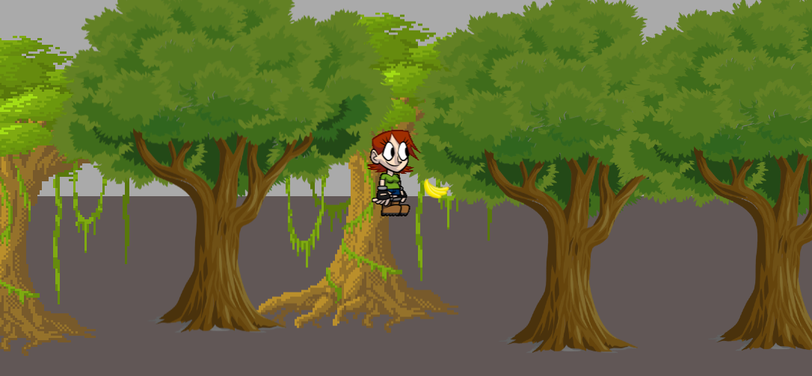
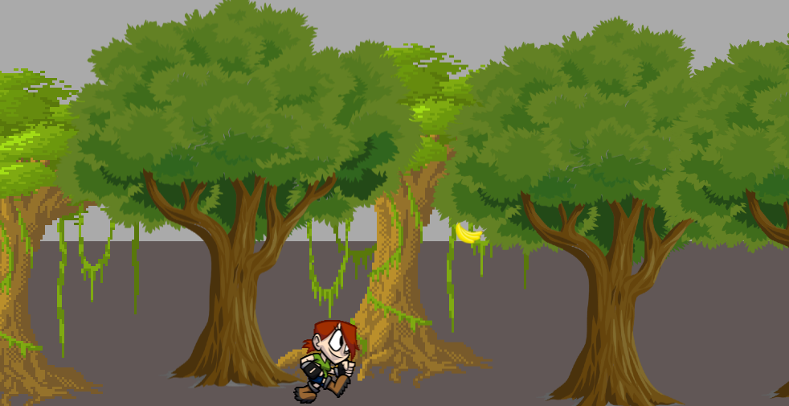

Template of game
================

Game was written in JS with minimal dependencies. Pixi.js is used for 2D graphics.  
Webpack was used for assembly of project.

How to use
----------
To run the template you need execute the following commands:
**npm install** - for installing  all the dependencies

**npm start** or **npm run-script start** - for starting game.
Execution of this command will start the server and will open new browser tab.

Examples
--------

